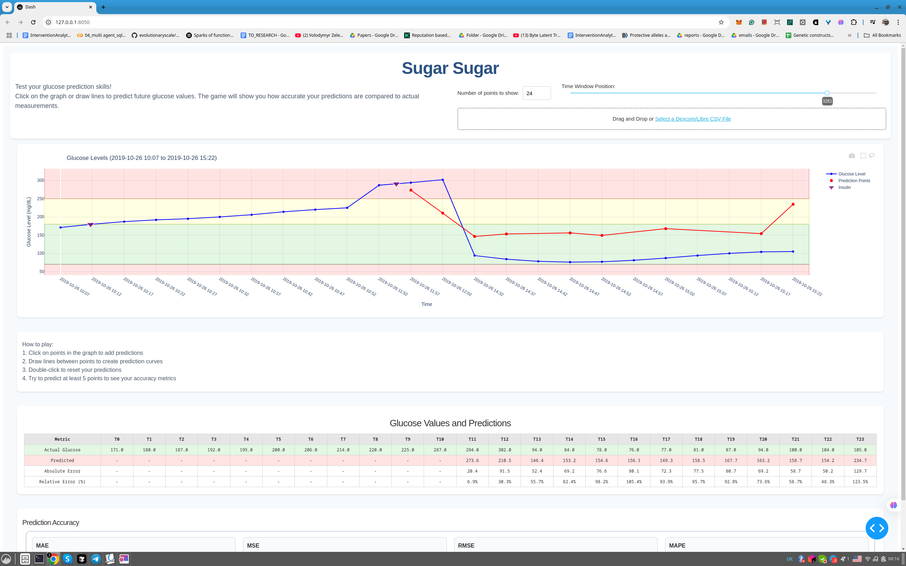

# sugar-sugar
A fun game to test your glucose-predicting superpowers! 🎯

Ever wondered how good you are at predicting where your glucose levels are heading? sugar-sugar turns this into an engaging game where you test your glucose-spotting skills against real CGM data.

## How It Works

1. **Load Your Data**: Upload your own Dexcom or Libre CSV file, or use our example dataset (At the momemt we haven't yet fully tested the load your own data function-however the sample dataset is available and working)
2. **Make Predictions**: Click and draw on the glucose chart to predict future glucose values
3. **Compare Results**: Your predictions are compared against the actual glucose values from the file
4. **See Your Accuracy**: Get detailed metrics showing how close your predictions were to reality

The game shows you historical glucose data up to a certain point, then challenges you to predict what happens next. Since the file contains the actual "ground truth" values, we can precisely measure how accurate your human intuition is compared to what really happened.

Why did we create this? While fancy AI models are being built to predict glucose values, we realized nobody really knows how good humans are at this - especially experienced CGM users who've developed an instinct for their patterns. By playing sugar-sugar, you're not just having fun, you're also helping us understand:
- How accurate are humans at predicting glucose trends?
- What patterns do experienced CGM users notice that computers might miss?
- Could this help make better prediction tools in the future?

> 🎵 Fun fact: The name "sugar-sugar" was inspired by a scientific remake of The Archies' classic hit song ["Sugar, Sugar"](https://www.youtube.com/watch?v=jJvAL-iiLnQ) from 1969!

## Screenshots

*sugar-sugar in action - try to predict where that line is going!*

## Setup

### Prerequisites
- Python 3.11 or higher
- UV (Python package manager)

### Installing UV
1. **Windows/macOS/Linux**:
```bash
curl -LsSf https://astral.sh/uv/install.sh | sh
```

2. **Alternative method** (using pip):
```bash
pip install uv
```

3. **Using Homebrew** (macOS):
```bash
brew install uv
```

For detailed installation instructions, visit the [UV documentation](https://docs.astral.sh/uv/getting-started/installation/).

### Installation
1. Clone the repository:
```bash
git clone https://github.com/GlucoseDAO/sugar-sugar.git
cd sugar-sugar
```

2. Install dependencies using UV:
```bash
uv sync
```

3. Install development dependencies (optional):
```bash
uv sync --group dev
```

### Configuration
1. Copy the environment template and customize your settings:
```bash
cp .env.template .env
```

2. Edit `.env` to configure your server settings:
```bash
# Dash Application Configuration
DASH_HOST=127.0.0.1      # Host to run the server on
DASH_PORT=8050           # Port to run the server on
DASH_DEBUG=True          # Enable Dash debug mode
DEBUG_MODE=False         # Enable application debug features (test button)
```

### Running the Game
```bash
uv run start
```

You can also override configuration via command line:
```bash
# Run on a different host/port
uv run start --host 0.0.0.0 --port 3000

# Enable debug mode for development
uv run start --debug

# Combine options
uv run start --host 0.0.0.0 --port 3000 --debug
```

Note: Debug mode adds a "Just Test Me" button for quickly filling in the form during development.

## KNOWN ISSUES:

- Currently only Dexcom and Libre 3 are supported. We will add support for other CGM devices soon.
- No scoring system and difficulty levels yet.
- Import your own data hasn't been fully tested

## FAQ

### Is this production-ready software?
This is an early-stage project meant for research and experimentation. The app now supports multiple users with session-based state management.

### Do you use my personal data?
No, we only use the data you upload to allow you play the game. We do not store any data from your uploads (the data is loaded to temp folder and deleted after the game session is over).

### How accurate can glucose predictions be?
Glucose prediction is complex! Research shows that CGM data alone often isn't enough for highly accurate predictions. Other factors like physical activity, meals, insulin, and stress play crucial roles. For a deep dive into state-of-the-art machine learning approaches to glucose prediction, check out [GlucoBench](https://github.com/IrinaStatsLab/GlucoBench) ([paper](https://arxiv.org/abs/2410.05780)), which provides benchmarks and datasets for glucose prediction models.

### Can I contribute?
We welcome pull requests, bug reports, and feature suggestions through GitHub issues. Check out our contributing guidelines for more details.

### I have an idea for improvement!
Great! Feel free to:
- Open an issue to discuss your idea
- Submit a pull request with your changes
- Reach out to the contributors directly

## Contribution statement
- **Livia Zaharaia** (GlucoseDAO) - Core Developer
- **Anton Kulaga** (Institute for Biostatistics and Informatics in Medicine and Ageing Research) - Core Developer
- **Irina Gaynanova** (Department of Statistics and Department of Biostatistics, University of Michigan) - Scientific Advisor

## Technical Architecture

sugar-sugar is built with [Plotly Dash](https://dash.plotly.com/), creating an interactive web application for glucose prediction gaming. The app uses session-based state management to support multiple users and processes CGM data from Dexcom and Libre devices without storing any personal information permanently.

### Application Structure

```
sugar_sugar/
├── app.py                  # Main application and routing logic
├── config.py              # Application constants and configuration
├── data.py                 # Data loading and processing utilities
└── components/             # Modular UI components
    ├── startup.py          # User registration and consent page
    ├── header.py           # Game controls and file upload
    ├── glucose.py          # Interactive glucose visualization
    ├── predictions.py      # Prediction data table
    ├── metrics.py          # Accuracy metrics display
    └── submit.py           # Game submission logic
    └── ending.py           # Results summary page
```

### Core Components and Their Roles

#### 1. **Application Core (`app.py`)**
- **Purpose**: Main application orchestration and routing
- **Key Features**:
  - Multi-page routing (startup → prediction → ending)
  - Session storage management for user state
  - Component integration and callback coordination
  - Data format conversion between session storage and components

#### 2. **Startup Page (`startup.py`)**
- **Purpose**: User onboarding and data consent
- **Key Features**:
  - Comprehensive user information collection (demographics, medical history)
  - Data usage consent and privacy information
  - Form validation with required field indicators
  - Debug mode for development testing

#### 3. **Header Component (`header.py`)**
- **Purpose**: Game controls and data management
- **Key Features**:
  - CGM file upload (Dexcom/Libre CSV formats)
  - Time window position slider for data navigation
  - Points control for adjusting visible data range (24-48 points)
  - Game instructions and user guidance

#### 4. **Glucose Chart (`glucose.py`)**
- **Purpose**: Interactive glucose data visualization and prediction interface
- **Key Features**:
  - Displays historical glucose data from uploaded CSV files
  - Interactive prediction drawing via click-and-drag on the chart
  - Real-time glucose line plotting with color-coded safety ranges
  - Event markers for insulin, exercise, and carbohydrate events
  - Dynamic y-axis scaling based on data range
  - Session storage integration for state persistence

#### 5. **Prediction Table (`predictions.py`)**
- **Purpose**: Structured display comparing user predictions against ground truth
- **Key Features**:
  - Side-by-side comparison of predicted vs actual glucose values (from CSV)
  - Real-time table updates as predictions are drawn on the chart
  - Automatic interpolation between prediction points
  - Absolute and relative error calculations showing prediction accuracy
  - Time-indexed columns for easy temporal comparison

#### 6. **Metrics Component (`metrics.py`)**
- **Purpose**: Statistical accuracy measurement comparing predictions to ground truth
- **Key Features**:
  - Multiple accuracy metrics (MAE, RMSE, MAPE, R²) calculated against actual CSV values
  - Minimum 5 predictions required for statistical validity
  - Real-time calculation updates as more predictions are added
  - Detailed metric descriptions for user education about prediction quality

#### 7. **Submit Component (`submit.py`)**
- **Purpose**: Game completion and data export
- **Key Features**:
  - Prediction statistics export to CSV
  - User session data persistence
  - Unique session ID generation
  - Research data collection (anonymized)

#### 8. **Ending Page (`ending.py`)**
- **Purpose**: Results summary and game completion
- **Key Features**:
  - Complete prediction visualization
  - Final accuracy metrics display
  - Session summary with all predictions
  - Option to exit or restart

### Data Processing Layer (`data.py`)

- **CGM Format Detection**: Automatic detection of Dexcom vs Libre data formats
- **Data Standardization**: Conversion of different CGM formats to unified schema
- **Event Processing**: Extraction and categorization of diabetes management events
- **Time Series Handling**: Proper datetime parsing and chronological sorting

### State Management Architecture

The application uses Dash's session storage (`dcc.Store`) for state management:

- **Session Isolation**: Each user gets independent session storage
- **Data Persistence**: User state maintained across page navigation
- **Component Communication**: Centralized state updates trigger component re-renders
- **Memory Efficiency**: Automatic cleanup when sessions end

### Key Technical Features

- **Multi-CGM Support**: Handles both Dexcom G6 and Libre 3 data formats
- **Real-time Interactivity**: Immediate feedback as users make predictions
- **Responsive Design**: Bootstrap-based UI that works on various screen sizes
- **Privacy-First**: No server-side data storage, all processing client-side
- **Research Integration**: Optional anonymized data collection for glucose prediction research
