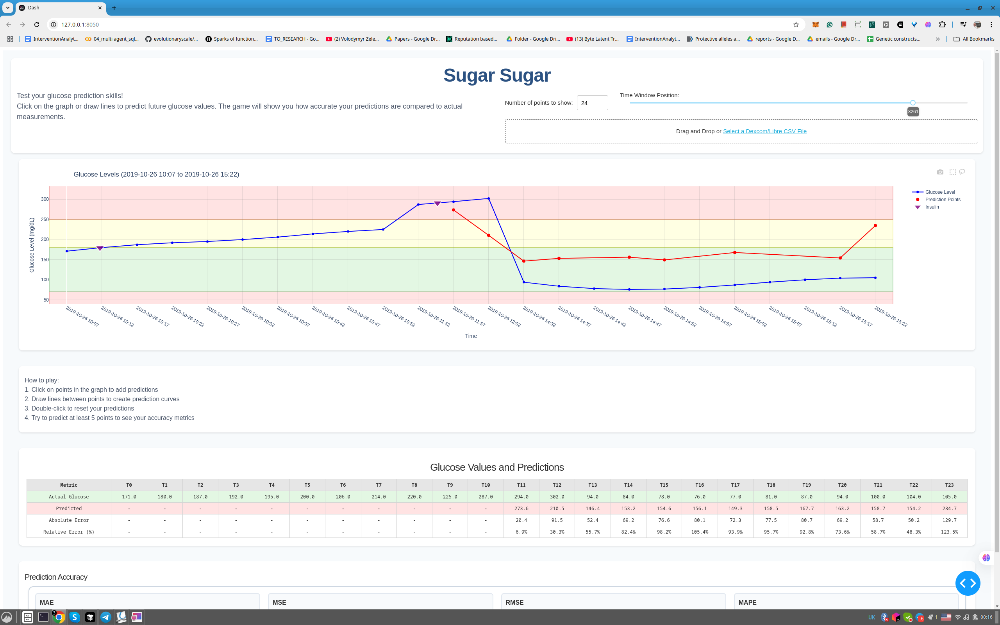

# sugar-sugar

A game to test your glucose-predicting superpowers! 🎯

> 🎵 The name "sugar-sugar" was inspired by a scientific remake of The Archies' classic hit song ["Sugar, Sugar"](https://www.youtube.com/watch?v=jJvAL-iiLnQ) from 1969!

## What is Sugar Sugar?

Sugar Sugar is a web-based research app built with [Plotly Dash](https://dash.plotly.com/). It turns glucose forecasting into an interactive game: you see part of a CGM trace, draw how you think it will continue, then compare your prediction with the real values. Your accuracy is measured with standard forecasting metrics (MAE, RMSE, MAPE).

## Why this study matters

### For people with diabetes

Accurate short-term glucose forecasts can support safer day-to-day decisions about insulin, carbohydrates, exercise, and timing. Better prediction can help reduce dangerous highs and lows and make glucose management less stressful.

### For people without diabetes

Glucose is a core metabolic signal linked to energy, cognition, mood, exercise response, and long-term health. Prediction can reveal how food, sleep, stress, and activity shape metabolism in real time — useful for preventive health and lifestyle optimisation.

### Establishing a human baseline for machine learning

There is currently no published human-baseline benchmark for CGM glucose prediction. Without knowing how well an informed human can predict glucose trends, we cannot assess whether any ML model is genuinely useful — it might be worse than a knowledgeable diabetic, or better only in specific scenarios. This study establishes that baseline so future ML models can be compared meaningfully.

For a deep dive into state-of-the-art ML approaches to glucose prediction, see [GlucoBench](https://github.com/IrinaStatsLab/GlucoBench) ([paper](https://arxiv.org/abs/2410.05780)).

## Ethics approval and study credibility

Sugar Sugar is part of a real research effort. The study received clearance from the Ethics Committee of University Medicine Rostock (Ethikkommission der Universitätsmedizin Rostock), Germany. It is an open-source, community-driven project run by [GlucoseDAO](https://github.com/GlucoseDAO).

## How the gameplay works

1. **Load your data** — Upload a Dexcom, Libre, Medtronic, or Nightscout file, or use the built-in generic sample dataset.
2. **Make predictions** — Click and drag on the glucose chart to draw your forecast for the hidden hour ahead.
3. **Compare results** — Your predictions are compared against the actual glucose values.
4. **See your accuracy** — Get MAE, RMSE, and MAPE metrics showing how close you were.

The game has up to 12 rounds. Each round takes about 2–3 minutes; a full session is around 30 minutes. You can stop at any time and resume later in the same browser.

## Screenshots


*sugar-sugar in action — try to predict where that line is going!*

## Data and privacy

Sugar Sugar supports two modes:

- **Play-only mode**: check **"I just want to play (do not store my CGM / gameplay data)"** on the landing page and the app will not save any study outputs. No data leaves your device.
- **Study mode** (default): if you do not check play-only, the app may write **consent + study outputs** to CSV for research (predictions vs ground truth, accuracy metrics, anonymised questionnaire responses).

Until you choose to submit, everything stays in your own browser's localStorage. Nothing is sent to our servers without your active consent.

Raw uploaded CGM files are used only to run the game and are not kept permanently.

## Resume and study integrity

Your progress is saved locally in the browser. You can close the tab and return later — you will be offered to continue from where you left off.

Please do not restart just because you are unhappy with your accuracy. People naturally prefer to keep good scores and discard bad ones, but that would skew the study and make the results less scientifically valid. If you feel disappointed, continue with another round rather than resetting your progress.

## Bug reports and contributing

### Found a bug?

Please open an issue at [https://github.com/GlucoseDAO/sugar-sugar](https://github.com/GlucoseDAO/sugar-sugar). Bug reports are very helpful for improving the app and for catching anything that could affect data quality.

### Software developers

Contributions are welcome through the project GitHub. We especially welcome:

- Bug fixes and UI improvements
- Support for more CGM devices or file formats
- Localisation improvements

Because this is an active study, changes that affect the core study design (new questionnaire fields, modifications to the prediction task) should be discussed with the team first to ensure data consistency across participants.

### Everyone else

You can still help a lot:

- Share the study with CGM communities, diabetes support groups, and metabolic health enthusiasts.
- Report unclear wording or usability issues via GitHub issues.
- Reach out through the [Contact](https://github.com/GlucoseDAO/sugar-sugar) page if you would like to collaborate.

## Contribution statement

- **Livia Zaharaia** (GlucoseDAO) — Core Developer
- **Anton Kulaga** (Institute for Biostatistics and Informatics in Medicine and Ageing Research) — Core Developer
- **Irina Gaynanova** (Department of Statistics and Department of Biostatistics, University of Michigan) — Scientific Advisor

## Technical setup

### Prerequisites

- Python 3.11 or higher
- UV (Python package manager)

### Installing UV

```bash
# Windows/macOS/Linux
curl -LsSf https://astral.sh/uv/install.sh | sh

# Or via Homebrew (macOS)
brew install uv
```

For full installation instructions see the [UV documentation](https://docs.astral.sh/uv/getting-started/installation/).

### Installation

```bash
git clone https://github.com/GlucoseDAO/sugar-sugar.git
cd sugar-sugar
uv sync
```

### Chrome / Chromium (for share-card image export)

The share page renders a 1200x630 PNG card using [kaleido](https://github.com/plotly/Kaleido), which needs a Chromium-based browser. On startup the app ensures **Chrome for Testing** is downloaded into `~/.local/share/choreographer/deps/` via `uv run setup-chrome`; it prefers that managed binary over a system/snap Chromium so a broken system browser cannot silently win.

Chrome for Testing is not a fully static executable: on bare Linux hosts it still needs Chromium runtime shared libraries. On Ubuntu 24.04, install the runtime library set before starting gunicorn:

```bash
sudo apt-get update
sudo apt-get install -y \
  libatk1.0-0t64 libatk-bridge2.0-0t64 libcups2t64 libdrm2 \
  libxkbcommon0 libxcomposite1 libxdamage1 libxfixes3 libxrandr2 \
  libgbm1 libpango-1.0-0 libcairo2 libasound2t64 libatspi2.0-0t64 \
  libnss3 libnspr4
uv run setup-chrome
```

If image export falls back to the static `assets/og-card.png`, check `logs/sugar_sugar.log` for `share_png_kaleido_failed`. A direct smoke test for the managed Chrome binary is:

```bash
CHROME=$(find ~/.local/share/choreographer -type f -name chrome -path '*chrome-linux64*' | head -1)
"$CHROME" --headless --no-sandbox --disable-gpu --disable-dev-shm-usage --dump-dom about:blank
```

Harmless DBus warnings are common on servers; an exit code of `0` with basic HTML output means Chrome can launch.

### Docker

```bash
docker build -t sugar-sugar .
docker run -p 8050:8050 sugar-sugar
```

The included `Dockerfile` installs system Chromium so share-card rendering works out of the box.

### Configuration

```bash
cp .env.template .env
```

Edit `.env` to configure your server settings:

```bash
DASH_HOST=127.0.0.1
DASH_PORT=8050
DEPLOY_URL=https://sugar-sugar.study
DASH_DEBUG=True
DEBUG_MODE=False
UMAMI_SCRIPT_URL=https://sugar-sugar.study/stats/script.js
UMAMI_WEBSITE_ID=7c6fb178-d8ff-439e-a9f3-e289d9ec7e97
UMAMI_DOMAINS=sugar-sugar.study
UMAMI_HOST_URL=https://sugar-sugar.study/stats
```

Umami tracking is disabled when either `UMAMI_SCRIPT_URL` or `UMAMI_WEBSITE_ID` is blank.
`UMAMI_DOMAINS` limits counting to listed production hostnames, and `UMAMI_HOST_URL`
points Umami pageview requests at the same-domain `/stats` proxy.

`DEPLOY_URL` is the canonical public origin used for Open Graph/Twitter preview
tags, share URLs, `/robots.txt`, `/sitemap.xml`, and `/llms.txt`. Set it in
production and restart the server after changing it.

### Running the app

```bash
uv run start
```

Override via command line:

```bash
uv run start --host 0.0.0.0 --port 3000 --debug
```

### Production serving

Use `uv run serve` for staging or production. It runs the Dash Flask server
through gunicorn instead of Werkzeug, so the development-server warning is gone.

```bash
uv run serve --host 0.0.0.0 --port 8050 --workers 2
```

Useful production environment variables:

```bash
DEPLOY_URL=https://sugar-sugar.study
DASH_HOST=0.0.0.0
DASH_PORT=8050
GUNICORN_WORKERS=2
GUNICORN_TIMEOUT=120
```

Serve it behind a TLS reverse proxy such as Caddy or nginx. The app respects
`X-Forwarded-Host` and `X-Forwarded-Proto` when `DEPLOY_URL` is not set, but
`DEPLOY_URL` is the preferred production source of truth.

### Quick chart debugging

Skip landing/startup/consent and jump straight to the prediction chart:

```bash
uv run chart
uv run chart --file /path/to/export.csv
uv run chart --prefill                # pre-fill predictions for testing submit flow
uv run chart --prefill --noise 0.10   # ±10% noise
uv run chart --unit mmol/L --locale de
```

### Mobile screenshot harness

Generate deterministic mobile screenshots for layout review:

```bash
uv run python scripts/mobile_shots.py
uv run python scripts/mobile_shots.py --device iphone-se
uv run python scripts/mobile_shots.py --only chart
uv run python scripts/mobile_shots.py --language-set babylon
```

By default, the harness keeps the historic English-only behaviour and writes flat
PNGs to `data/output/mobile_shots/`, for example
`prediction-android-narrow-landscape.png`. Use `--language-set babylon`
(`--variant babylon` also works) to render every supported locale and write one
folder per language, for example `data/output/mobile_shots/ro/*.png`.

The script starts the app twice: the `entry` group uses `uv run start` for
landing, consent, startup wizard steps, about, FAQ, contact, and demo pages; the
`chart` group uses `uv run chart --prefill --no-debug --no-reloader` for the
prediction page in portrait and landscape. Other useful options:

- `--device android-narrow|iphone-se|iphone-13|pixel-7` changes the viewport preset.
- `--only entry` or `--only chart` limits the run to one server group.
- `--out <dir>` changes the output root.
- `--port <port>` changes the spawned server port.
- `--base-url http://127.0.0.1:8050` screenshots an already-running server instead of spawning one.

See `docs/mobile-version.md` for the full harness design notes and CDP emulation
pitfalls.

### Share page debugging

Preview the share page with synthetic prediction data — no need to play a full game:

```bash
uv run share                            # single-format (Generic), 12 rounds
uv run share --formats "A,B,C"          # multi-format: Generic + My Data + Mixed
uv run share --formats "A,B" --rounds 8 # custom round count
uv run share --locale de                # test in German
```

Formats: **A** = Generic, **B** = My Data, **C** = Mixed. Rounds cycle through formats evenly (e.g. 12 rounds with A,B,C → 4 rounds each). The command generates a share record, saves it to disk, and opens the browser at `/share/<id>`. Useful for testing the share card PNG, OG tags, social buttons, and per-format colour palettes.

To render the social-card PNGs for manual inspection across every supported
translation, use the deterministic preview script:

```bash
uv run python scripts/render_share_card_previews.py
uv run python scripts/render_share_card_previews.py --locale de
uv run python scripts/render_share_card_previews.py --output-dir /tmp/share-card-previews
```

It writes both single-format and multi-format stress previews to
`data/output/share-card-previews/` (`share-card-<locale>-single.png` and
`share-card-<locale>-multi.png`). Use this before deploying social-preview
layout changes to catch dangling translated headers, QR/text overlaps, and CJK
wrapping issues.

### Social previews and crawler metadata

The app exposes crawler-ready metadata in two layers:

- Site-wide Open Graph/Twitter tags in the Dash HTML shell, pointing at
  `/assets/og-card.png?v=1`. The file should be a 1200x630 PNG.
- Per-result share URLs at `/share/<id>`. Social crawlers receive a thin OG shell
  with the share card image at `/share/<id>/image.png`; humans see the live Dash
  share page.

Crawler helper routes are available at `/robots.txt`, `/sitemap.xml`, and
`/llms.txt`.

To verify the raw crawler response:

```bash
curl -sL -A "Twitterbot/1.0" https://sugar-sugar.study/ | rg 'og:|twitter:'
curl -sI https://sugar-sugar.study/assets/og-card.png?v=1
curl -sL -A "facebookexternalhit/1.1" https://sugar-sugar.study/share/<id> | rg 'og:'
```

After deploying preview changes, force re-scrapes with the Facebook Sharing
Debugger, LinkedIn Post Inspector, and Telegram's `@WebpageBot`. Many networks
cache previews for days, especially when the image URL does not change.

### Clearing localStorage during development

```bash
uv run start --clean   # clears localStorage on every page load
```

### Testing the resume dialog

1. `uv run start`
2. Walk through landing and startup pages.
3. Close the tab (do **not** stop the server).
4. Reopen `http://127.0.0.1:8050/` — the resume dialog should appear.

## Technical architecture

```
sugar_sugar/
├── app.py                  # Main application and routing logic
├── config.py               # Application constants and configuration
├── data.py                 # Data loading and processing utilities
├── consent.py              # Consent CSV persistence utilities
└── components/
    ├── landing.py          # Landing + consent/choices page
    ├── startup.py          # User registration (demographics/medical history)
    ├── header.py           # Game controls and file upload
    ├── glucose.py          # Interactive glucose visualization
    ├── predictions.py      # Prediction data table
    ├── metrics.py          # Accuracy metrics display
    ├── submit.py           # Game submission logic
    └── ending.py           # Results summary page
```

State management uses Dash `dcc.Store` components. The storage backend is controlled by `STORAGE_TYPE`:

| Value | Behaviour |
|-------|-----------|
| `local` (default) | Persists in `localStorage` — survives browser restarts. |
| `session` | Persists in `sessionStorage` — cleared when the tab closes. |
| `memory` | Lives only in React state — cleared on any page refresh. |

## Known issues

- Nightscout import is planned but not yet fully implemented.
- No scoring system or difficulty levels yet.
